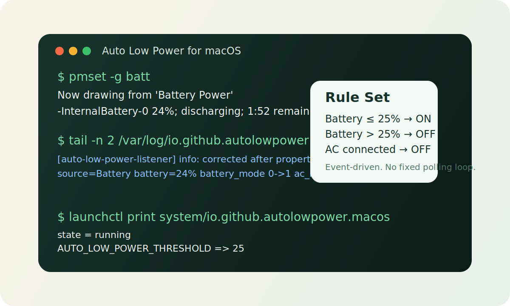

# Auto Low Power for macOS

[](https://github.com/wang-yzh/auto-low-power-macos/actions/workflows/ci.yml)

Event-driven Low Power Mode automation for Mac laptops.



## What it does

- Turns Low Power Mode on when the Mac is on battery and the battery is at or below a threshold.
- Turns Low Power Mode off when the Mac is on battery and the battery is above that threshold.
- Always turns Low Power Mode off when AC power is connected.

Default threshold: `25%`

## Install options

### Homebrew tap

```bash
brew tap wang-yzh/auto-low-power-macos
brew install auto-low-power-macos
sudo auto-low-power-install
```

The tap repository is:

- `wang-yzh/homebrew-auto-low-power-macos`

Install with a custom threshold:

```bash
sudo AUTO_LOW_POWER_THRESHOLD=30 auto-low-power-install
```

### One-line install

```bash
curl -fsSL https://raw.githubusercontent.com/wang-yzh/auto-low-power-macos/main/scripts/quick-install.sh | bash
```

### From a local clone

```bash
sudo ./scripts/install.sh
```

## Why this project exists

macOS exposes Low Power Mode, but it does not provide a built-in way to enable it automatically at a custom battery threshold and disable it again when power is connected.

This project fills that gap with a small root `launchd` daemon.

## How it works

The daemon listens to IOKit events from:

- `AppleSmartBattery`
- `AppleSmartBatteryManager`

When an event arrives, it:

1. Reads the authoritative current power source via `IOPowerSources`.
2. Reads the current battery percentage.
3. Reads the current AC/Battery Low Power Mode values from the system power management plist.
4. Computes the desired state.
5. Calls `pmset` only if a change is actually needed.

This keeps the behavior event-driven instead of time-polling.

## Requirements

- macOS laptop with an internal battery
- administrator access

Verbose debug logging:

```bash
sudo AUTO_LOW_POWER_DEBUG=1 ./scripts/install.sh
```

Correction cooldown override:

```bash
sudo AUTO_LOW_POWER_APPLY_COOLDOWN_SECONDS=1 ./scripts/install.sh
```

## Uninstall

```bash
sudo ./scripts/uninstall.sh
```

## Inspect status

Current battery source:

```bash
pmset -g batt
```

Current daemon status:

```bash
launchctl print system/io.github.autolowpower.macos
```

Current installed configuration:

```bash
plutil -p /Library/LaunchDaemons/io.github.autolowpower.macos.plist
```

Daemon log:

```bash
tail -n 50 /var/log/io.github.autolowpower.macos.log
```

## Logging

By default, logs are quiet:

- startup matches
- actual corrections
- fatal or operational errors

Enable verbose logs with:

```bash
sudo AUTO_LOW_POWER_DEBUG=1 ./scripts/install.sh
```

Verbose mode adds:

- raw IOKit event names
- event snapshots
- duplicate-correction suppression messages

## Limitations

- This is macOS-specific.
- It depends on Apple power-management event delivery.
- If you manually change Low Power Mode, the daemon will restore the rule-based state on the next relevant power event.

## Repository notes

This repository contains source code, install scripts, CI, packaging, and Homebrew tap metadata.

Release archives are built from tagged source and can be installed through the quick-install path.
